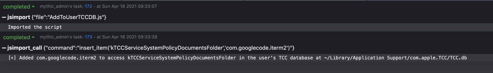

# Add-To-TCC-DB
A JXA script that leverages sqlite3 API calls to add items to the user's TCC database at: 

**~/Library/Application Support/com.apple.TCC/TCC.db**

This is a follow-up repo to Antonio Piazza's JXA code to view TCC db contents at: https://github.com/antman1p/PrintTCCdb

**NOTE: Terminal must already have full disk access to write to the user's TCC.db**

This JXA script takes two arguments:

==> First Argument is what TCC access you would like to grant. Examples include:

- **kTCCServiceSystemPolicyDownloadsFolder** (for Downloads folder access), 
- **kTCCServiceSystemPolicyDocumentsFolder** (for Documents folder access), 
- **kTCCServiceAppleEvents** (for Apple Events),
- **kTCCServiceCamera** (for Camera),

==> Second argument is the bundleID of the application that you want to grant TCC access to. NOTE: This must be the application bundle identifier, not the application name. To find an app's bundle ID from Terminal you can run:

> osascript -e 'id of app "[app_name]"

One this script is run, the specified app will be added with the specified access at the user's TCC.db.

## To Use in Mythic C2

This example below is me granting iterm2 access to my Documents folder:

>  jsimport {"file":"AddToUserTCCDB.js"}

>  jsimport_call {"command":"insert_item('kTCCServiceSystemPolicyDocumentsFolder','com.googlecode.iterm2')"}

